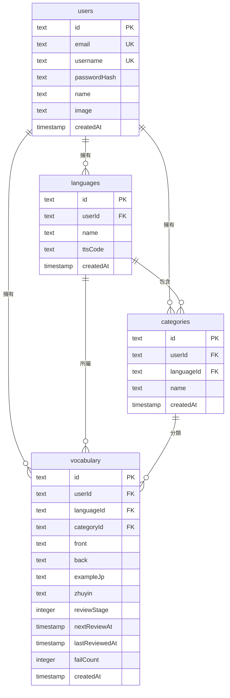

# 資料庫 Schema

**ORM：** Drizzle ORM
**資料庫：** Neon PostgreSQL（Serverless）
**Schema 定義位置：** `lib/db/schema.ts`
**Migration：** `npx drizzle-kit push`（設定於 `drizzle.config.ts`）

---

## 關聯圖

---

## 資料表詳細說明

### `users`

| 欄位 | 型別 | 說明 |
|------|------|------|
| `id` | text PK | UUID |
| `email` | text, unique, nullable | 電子郵件（目前功能未使用） |
| `username` | text, unique, nullable | 登入帳號 |
| `passwordHash` | text, nullable | bcryptjs hash（salt rounds: 10） |
| `name` | text, nullable | 顯示名稱 |
| `image` | text, nullable | 頭像 URL |
| `createdAt` | timestamp | 建立時間，預設 now() |

---

### `languages`

| 欄位 | 型別 | 說明 |
|------|------|------|
| `id` | text PK | UUID |
| `userId` | text FK → users | 刪除 user 時 cascade delete |
| `name` | text | 顯示名稱（如「日文」） |
| `ttsCode` | text | BCP-47 語言代碼（如 `ja-JP`） |
| `createdAt` | timestamp | 預設 now() |

**預設語言設定（`lib/languages-config.ts`）：**

| 語言 | ttsCode |
|------|---------|
| 中文 | zh-TW |
| 英文 | en-US |
| 日文 | ja-JP |
| 韓文 | ko-KR |
| 廣東話 | zh-HK |

---

### `categories`

| 欄位 | 型別 | 說明 |
|------|------|------|
| `id` | text PK | UUID |
| `userId` | text FK → users | Cascade delete |
| `languageId` | text FK → languages, nullable | Cascade delete |
| `name` | text | 分類名稱 |
| `createdAt` | timestamp | 預設 now() |

> **「未分類」虛擬分類：** `categoryId = null` 的詞彙在 UI 中顯示為「未分類」，不存在實際資料庫紀錄。查詢時使用特殊值 `"uncategorized"` 篩選。

---

### `vocabulary`

| 欄位 | 型別 | 說明 |
|------|------|------|
| `id` | text PK | UUID |
| `userId` | text FK → users | Cascade delete |
| `languageId` | text FK → languages, nullable | 語言刪除時 set null（不刪詞彙） |
| `categoryId` | text FK → categories, nullable | Cascade delete |
| `front` | text | 卡片正面（DB 欄位名：`japanese`） |
| `back` | text | 卡片背面（DB 欄位名：`chinese`） |
| `exampleJp` | text | 例句，預設空字串 |
| `zhuyin` | text | 注音標註，預設空字串 |
| `reviewStage` | integer | SRS 階段 0–6，預設 0 |
| `nextReviewAt` | timestamp | 下次複習時間，預設 now() |
| `lastReviewedAt` | timestamp, nullable | 最後複習時間 |
| `failCount` | integer | 累計答錯次數，預設 0 |
| `createdAt` | timestamp | 預設 now() |

> **欄位命名注意：** `front` / `back` 是程式碼中的名稱，資料庫實際欄位名為 `japanese` / `chinese`（歷史遺留命名，但功能通用於任何語言）。

---

## 刪除行為

| 刪除對象 | 影響 |
|----------|------|
| User | 刪除所有 languages, categories, vocabulary |
| Language | 刪除所有 categories；vocabulary.languageId 設為 null（詞彙保留） |
| Category | 刪除所有屬於該分類的 vocabulary |
