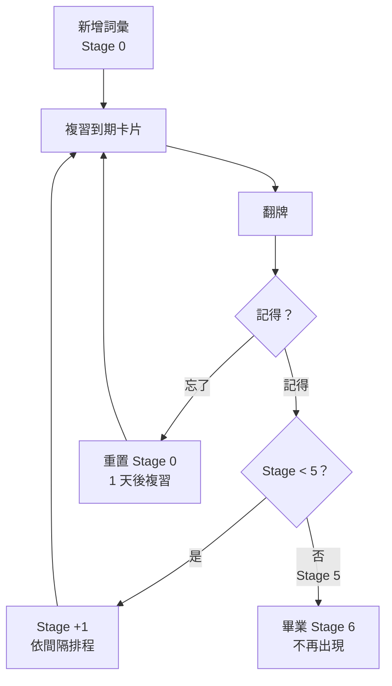

# 間隔重複系統（SRS）

**實作位置：** `lib/srs.ts`

---

## 什麼是 SRS？

間隔重複系統（Spaced Repetition System）是一種記憶科學技術。其核心原則是：
- 快要忘記一個詞彙時再複習，效果最好
- 每次成功記住後，拉長下次複習的間隔
- 答錯則重置間隔，從頭開始

---

## 6 個學習階段

| 階段 | 答對後間隔 | 說明 |
|------|----------|------|
| Stage 0 | 1 天後 → Stage 1 | 初學，短週期鞏固 |
| Stage 1 | 3 天後 → Stage 2 | |
| Stage 2 | 7 天後 → Stage 3 | |
| Stage 3 | 14 天後 → Stage 4 | |
| Stage 4 | 30 天後 → Stage 5 | 長週期確認記憶 |
| Stage 5 | 答對 → **畢業（Stage 6）** | 不再出現於複習佇列 |

> **答錯**：無論目前在哪個階段，都會重置回 Stage 0，1 天後再次出現。

---

## 流程圖



---

## 核心函式

### `getNextReviewAt(stage, remembered)`

計算下次複習時間與新階段。

```ts
// 答錯 → 重置
if (!remembered) {
  return { stage: 0, nextReviewAt: now + 1天 }
}

// 答對 → 升階
const nextStage = Math.min(stage + 1, 6)

// 畢業
if (nextStage === 6) {
  return { stage: 6, nextReviewAt: Infinity }
}

// 一般升階：時間正規化至當天午夜 UTC
const next = new Date(now + INTERVALS[stage])
next.setHours(0, 0, 0, 0)
return { stage: nextStage, nextReviewAt: next.getTime() }
```

**注意：** 下次複習時間會被正規化至午夜 UTC，避免每天在不同時間點出現。

### `isDueToday(nextReviewAt)`

```ts
return nextReviewAt !== Infinity && nextReviewAt <= Date.now()
```

畢業卡片（`Infinity`）永遠不會出現在複習佇列中。

---

## 多輪複習設計

複習工作階段（`ReviewClient.tsx`）在 SRS 之上加了一層多輪機制：

1. **第一輪** — 隨機洗牌，顯示所有到期卡片
2. **後續輪次** — 只顯示答錯的卡片（`failedIds`）
3. **結束** — 所有卡片都答對，顯示結果畫面

這個設計讓同一個複習工作階段中可以多次練習難記的詞彙，而不必等到隔天才再看到。

> **重要：** 每次點「記得」或「忘了」都會**立即**呼叫 `markReview()` Server Action，SRS 階段即時更新。多輪複習是 UI 層的展示邏輯，和 SRS 的資料庫記錄是分開的。

---

## failCount 欄位

每次答錯會讓 `vocabulary.failCount + 1`（累計，不重置）。
此數值用於錯誤排行榜（`/languages/[id]/stats`），方便找出長期難記的詞彙。
